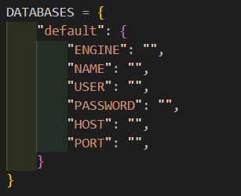

# TechManage

**TechManage**  es un sistema centralizado de gestión de inventario de computadoras que facilita el control y la
planificación de mantenimientos. Nuestro software le proporciona una plataforma integral para monitorizar el
estado de sus equipos, asegurando que cada computadora esté en óptimas condiciones y lista para su uso. 

***¡Bienvenidos a TechManage! Optimiza y cuida tu inventario tecnológico.***

|

*** 

---

## Pre-requisito

#### Instalar Git

+ Distribuciones Debian
~~~
sudo apt-get install git 
~~~
  
+ Windows

~~~
https://github.com/git-for-windows/git/releases/download/v2.44.0.windows.1/Git-2.44.0-64-bit.exe
~~~   

#### Instalar python
~~~
https://www.python.org/downloads/
~~~

#### Instalar Workbench
~~~
https://dev.mysql.com/downloads/workbench/
~~~

## Instalación

1. Abrir Visual Studio Code.
   
2. Clonar repositorio.
   
~~~
git clone https://github.com/Carlos-Leguizamo/TechManage.git
~~~

3. Creación del entorno virtual en python
~~~
python -m venv env
~~~

4. Activación del entorno virtual
~~~
env\Scripts\activate
~~~

5. Instalación de las dependencias
~~~
pip install -r requirements.txt
~~~

6. Configuración de la base de datos
 
En settings.py se pueden encontrar las credenciales de la base de datos

Existen varias herramientas para manejar la base de datos ya sea local o remota:

+ Xampp
+ Laragon
+ Workbench
+ Clever cloud
+ Railway

--- 

7. Correr el programa

~~~
python manage.py runserver
~~~

## :earth_africa: Lenguajes:

## :computer: Framework:

## :gear: Herramientas:

### Autores

@John Camilo Garzon Vargas :wave:

@Carlos Leguizamo :wave:

@Santiago Firigua :wave:

> [!NOTE]
> Muchas gracias por prestar atención.

> [!IMPORTANT]
> Sacamos iconos para el readme de este repositorio.  
> [Repositorio Icon](https://github.com/ZooaDeV/ZooaDev/blob/main/README.md)